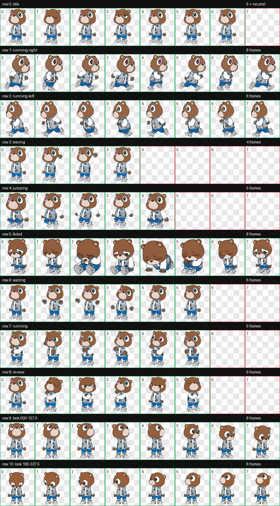
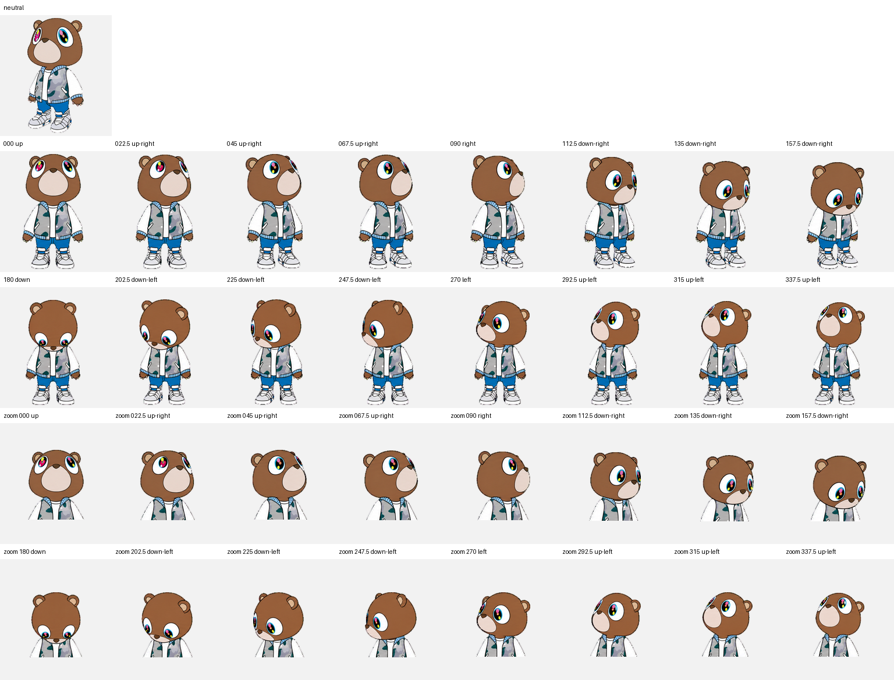

[README.md](https://github.com/user-attachments/files/30031806/README.md)
# YE BEAR 2007



**YE BEAR 2007** is a Codex-compatible animated pet inspired by the wide-eyed varsity bear artwork: a warm brown bear wearing a blue varsity jacket and bright white sneakers.

## Pet profile

- **Pet ID:** `varsity-bear`
- **Display name:** Varsity Bear
- **Sprite format:** Codex Pet v2
- **Animations:** 9 standard animation rows
- **Look system:** 16 directions
- **Style:** Hand-drawn cartoon mascot

## Look directions



The directional frames let the bear follow activity around the Codex interface while preserving the oversized eyes, varsity jacket, sneakers, and playful floating pose from the original character.

## Package contents

```text
YE-BEAR-2007/
├── pet.json               # Codex pet metadata
├── spritesheet.webp       # Animated 8 × 11 sprite sheet
├── contact-sheet.png      # Animation QA preview
├── look-directions.png    # Directional QA preview
└── run-summary.json       # Build and validation summary
```

## Install in Codex

1. Download or clone this repository.
2. Copy the pet package into your Codex pets directory.
3. Keep `pet.json` and `spritesheet.webp` together in the same folder.
4. Restart Codex, then select **Varsity Bear** from the pet picker.

Example folder layout:

```text
~/.codex/pets/varsity-bear/
├── pet.json
└── spritesheet.webp
```

## Technical details

The package uses `spriteVersionNumber: 2` and an 8-column by 11-row WebP sprite sheet. It includes all nine standard animation rows and has been visually checked with dedicated animation and directional contact sheets.

## Credits

Character concept based on the supplied YE BEAR 2007 reference artwork. Pet adaptation and sprite assembly created for Codex.
